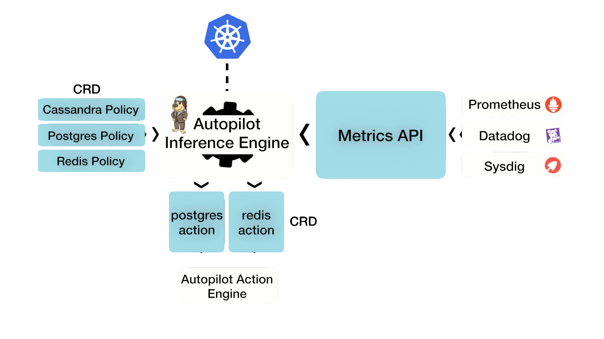
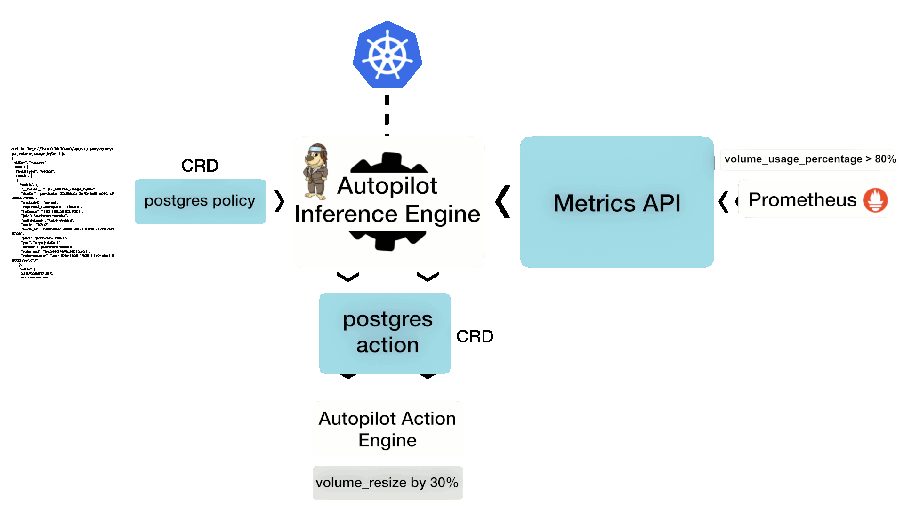

# AUTOPILOT

[](https://travis-ci.org/libopenstorage/autopilot-api)
[](https://goreportcard.com/report/github.com/libopenstorage/autopilot-api)


Application Runtime Management for Kubernetes

<div style="text-align:center"></div>

## Analytics Driven Automation

Autopilot is an automated application runtime monitoring engine built for stateful applications deployed in Kubernetes.  It implements a rule based analytical engine that is provided a set of application level conditions to monitor and the action to take if if the conditions trigger. These conditions are typically based on metrics/logs/traces from various popular stateful applications such as Postgres, Cassandra, ELK, Redis, Kafka and so on. Autopilot can correlate the metrics all the way down to the metrics exported at the system level (block devices, storage provides, node CPU and memory consumption).  Based on the the root cause analysis of the metrics, Autopilot can output actions, ensuring 5 nines availability and performance of stateful applications.

Autopilot relies on Kubernetes primitives and is self contained. Autopilot input rules and output actions are well defined [CRDs](https://kubernetes.io/docs/concepts/extend-kubernetes/api-extension/custom-resources/) that guide its application runtime management engine.

## What Autopilot does

Autopilot is a monitor-and-react engine.  It watches the metrics from the applications that it is monitoring, and based on certain conditions being met in those metrics, it reacts and alters the application's runtime environment.

At a high level, Autopilot is responsible for the following 3 action classes on an application:
1. Ensures an application and its containers are performing at the required levels via monitoring.  This includes the application's persistent volume properties.
2. Ensures high availability via redundancy - It can automatically increase or decrease the redundancy factor.
3. Allows for POD scaling and application level re-balancing.

Some examples of actions taken by Autopilot include:
1. Automatic Persistent Volume updates.  For example, the size of the volume, or the IO properties (IOPS) of the volume.
2. Automatic Persistent Volume relocation.  If an application is performing poorly due to the physical properties of a volume, Autopilot can facilitate in moving the volume to a healthier tier of storage.
3. Automatic IOPS scaling of a volume.  Sometimes, a volume's capacity or IOPS may be over provisioned, and Autopilot can adjust those properties.

## How it works

Autopilot is built as a set of policy and reaction modules, along with a metrics endpoint to monitor.  Every application module presents a set of policy CRDs for which Autopilot will react to.  Autopilot starts monitoring the metrics endpoint, and when certain conditions (as specified by the CRD) are met, Autopilot will automatically fire the corresponding corrective action.  The corrective action itself is just another CRD to which the system reacts to.

The diagram below shows the overall scheme.

<p align="center">
    
</p>

Once installed, Autopilot will start monitoring the metrics endpoints for various events as configured via the `Application Policy` CRDs.  When a trigger condition has been met, Autopilot will take a corrective action, as defined by the `Application Action` CRD.

With a complete set of policies installed, it is expected that Autopilot can ensure the overall health and performance of an application that it is monitoring.

## Examples of what Autopilot can do

When monitoring stateful applications, the persistent volume's health and performance has a lot to do with the overall application health.  The following two examples focus on how Autopilot can monitor the salient parameters from a Postgres deployments metrics and take action on the persistent volume in order to guarantee the healthy operation of Postgres.

### Automatically resizing a Postgres volume

<p align="center">
    
</p>

In this example, a Postgres deployment's persistent volume is about to run out of space.  Normally, this would cause the POD to go into a `not ready` state, and Kubernetes would not know how to take action to this.  In order to prevent application downtime, Autopilot takes corrective action and automatically resizes the PVC.

<p align="center">
    
</p>

### Automatically reacting to higher latencies from a Postgres deployment

In this next example, a Postgres deployment's persistent volume gradually experiences higher latencies.  This can happen due to many reasons, including degraded storage performance, noisy neighbors or poor network bandwidth to the storage devices.  Autopilot can be configured to monitor the latencies perceived by the database at the application layer and take corrective actions.  Such actions may incude:
1. Increase the IOPS provided to the persistent volume by the storage overlay.
2. Change the IOPS provided by the actual disk service provider (for example, alter the IOPS properties of an EBS volume in AWS).
3. Move the volumes contents (replicas) from one node (or disk) to another.  This requires the PVCs to be backed by a storage provider (such as Portworx) that can replicate contents at volume granularity.

In this scenario, Autopilot determines that it should move the Postgres volume from Kubernetes node `worker2` to `worker3`.  This movement is applicable when the storage overlay (the software backing the persistent volumes) is able to host replicas of the volume's contents on multiple nodes.  In this example, the PVCs are backed by Portworx volumes, which are replicated and available on multiple nodes in the Kubernetes cluster, allowing for such a relocation operation.

<p align="center">
    
</p>

### Detecting unauthorized volume access

Here, Autopilot detects that a PVC is being used outside of any namespace, violating the cgroup rules.

<p align="center">
    
</p>

## Running Autopilot

Refer to [Autopilot documentation](https://docs.portworx.com/portworx-install-with-kubernetes/autopilot/) for more details on running Autopilot and e2e examples.

## Development

### Vendoring

This repo uses [go dep](https://golang.github.io/dep/) for vendoring. The following make rule will update the vendor directory.

```shell
make vendor
```

### Code generation

Once you make changes to the CRD, use the following make rule to update the generated code. When committing changes, keep the generated code separate.

```shell
make codegen
```
